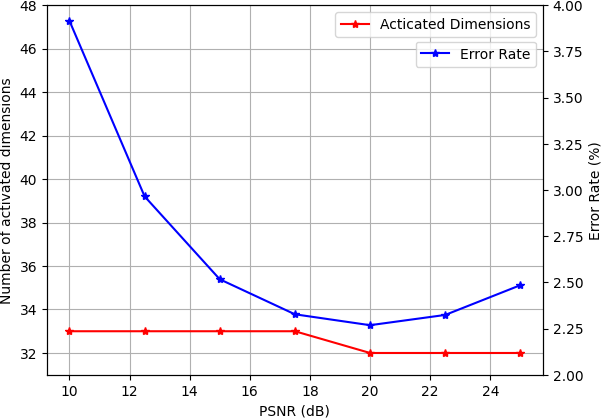
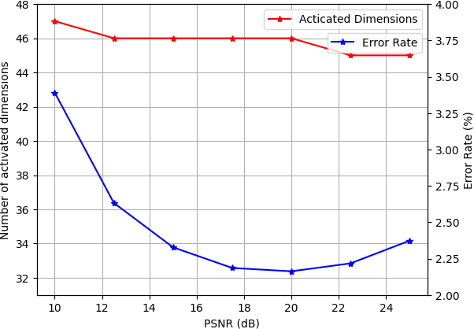
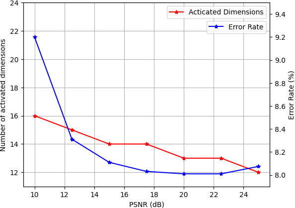
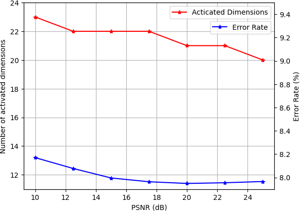

# Examples

We provides 4 pretrained models as examples. 

## The number of activated dimensions and error rate as a function of the channel PSNR on the MNIST dataset (Left: MNIST_Model1.pth, Right: MNIST_Model2.pth).

## The number of activated dimensions and error rate as a function of the channel PSNR on the CIFAR dataset (Left: CIFAR_Model1.pth, Right: CIFAR_Model2.pth).

